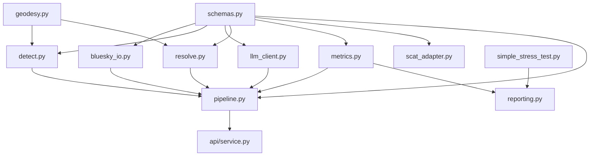

# ATC_LLM Dependency Matrix & Architecture Analysis

## Overview
This document provides a comprehensive analysis of the ATC_LLM (Air Traffic Control - Large Language Model) project dependencies, architecture, and inter-module relationships.

## Project Summary
- **Name**: LLM-BlueSky CDR (Conflict Detection and Resolution)
- **Version**: 0.1.0
- **Purpose**: LLM-driven conflict detection and resolution system for BlueSky aviation simulator
- **Language**: Python 3.11+
- **Architecture**: Modular pipeline-based system with safety-first design

## Core Module Dependencies

### 1. Foundation Layer (No Internal Dependencies)

#### `src/cdr/schemas.py`
**Purpose**: Data models and validation schemas using Pydantic
**External Dependencies**: 
- `pydantic` - Data validation and serialization
- `datetime` - Timestamp handling
- `enum` - Enumeration types
- `typing` - Type hints

**Key Classes**:
- `AircraftState` - Aircraft position, velocity, metadata
- `ConflictPrediction` - Predicted conflicts with timing
- `ResolutionCommand` - ATC resolution commands
- `LLMDetectionInput/Output` - LLM interface schemas
- `ConfigurationSettings` - System configuration

#### `src/cdr/geodesy.py`
**Purpose**: Aviation mathematics and geometry calculations
**External Dependencies**: 
- `math` - Mathematical functions
- `typing` - Type hints

**Key Functions**:
- `haversine_nm()` - Great circle distance
- `bearing_deg()` - Initial bearing calculation
- `cpa_nm()` - Closest Point of Approach
- `destination_point_nm()` - Forward navigation problem
- `cross_track_distance_nm()` - Distance to track

### 2. Integration Layer

#### `src/cdr/bluesky_io.py`
**Purpose**: BlueSky simulator interface and aircraft control
**Internal Dependencies**: 
- `schemas.py` - Data models
**External Dependencies**: 
- `bluesky` - Aviation simulator
- `logging` - System logging
- `math` - Mathematical calculations
- `atexit` - Resource cleanup

**Key Classes**:
- `BlueSkyClient` - Main simulator interface
- `BSConfig` - Configuration dataclass

**Key Functions**:
- `connect()` - Initialize embedded BlueSky
- `create_aircraft()` - Spawn aircraft
- `get_aircraft_states()` - Fetch positions/velocities
- `execute_command()` - Apply ATC commands

### 3. Algorithm Layer

#### `src/cdr/detect.py`
**Purpose**: Conflict detection algorithms with geometric predictions
**Internal Dependencies**: 
- `geodesy.py` - Mathematical functions
- `schemas.py` - Data models
**External Dependencies**: 
- `numpy` - Numerical computations
- `logging` - System logging

**Algorithm**: 10-minute lookahead using constant velocity assumption with CPA calculations

**Key Functions**:
- `predict_conflicts()` - Main detection algorithm
- `is_conflict()` - Conflict criteria evaluation
- `calculate_severity_score()` - Severity assessment
- `project_trajectory()` - Trajectory prediction

#### `src/cdr/llm_client.py`
**Purpose**: LLM integration for conflict detection and resolution
**Internal Dependencies**: 
- `schemas.py` - Data models
**External Dependencies**: 
- `requests` - HTTP communication
- `json` - JSON parsing
- `re` - Regular expressions
- `logging` - System logging

**Key Classes**:
- `LlamaClient` - Main LLM interface
- `LLMClient` - Backwards compatibility

**Key Functions**:
- `detect_conflicts()` - LLM-based detection
- `generate_resolution()` - LLM resolution generation
- `_post_ollama()` - Ollama HTTP interface

#### `src/cdr/resolve.py`
**Purpose**: Conflict resolution execution with safety validation
**Internal Dependencies**: 
- `geodesy.py` - Mathematical functions
- `schemas.py` - Data models
**External Dependencies**: 
- `logging` - System logging
- `math` - Mathematical calculations
- `datetime` - Timestamp handling

**Safety Features**:
- Oscillation guards
- Command history tracking
- Safety validation using CPA
- Fallback strategies

**Key Functions**:
- `execute_resolution()` - Main resolution execution
- `generate_horizontal_resolution()` - Heading changes
- `generate_vertical_resolution()` - Altitude changes
- `_validate_resolution_safety()` - Safety checks

### 4. Metrics & Analysis Layer

#### `src/cdr/metrics.py`
**Purpose**: Performance metrics collection (Wolfgang 2011 KPIs)
**Internal Dependencies**: 
- `schemas.py` - Data models
**External Dependencies**: 
- `json` - Data serialization
- `logging` - System logging
- `datetime` - Timestamp handling
- `numpy` - Statistical calculations
- `dataclasses` - Data structures

**Wolfgang 2011 KPIs**:
- **TBAS** - Time-Based Alerting Score
- **LAT** - Loss of Alerting Time
- **DAT** - Delay in Alert Time
- **DFA** - Delay in First Alert
- **RE** - Resolution Efficiency
- **RI** - Resolution Intrusiveness
- **RAT** - Resolution Alert Time

**Key Classes**:
- `MetricsCollector` - Data collection
- `MetricsSummary` - Aggregated metrics
- `ComparisonReport` - Baseline vs LLM comparison

#### `src/cdr/scat_adapter.py`
**Purpose**: Real aviation data processing (SCAT datasets)
**Internal Dependencies**: 
- `schemas.py` - Data models
**External Dependencies**: 
- `json` - Data parsing
- `logging` - System logging
- `pathlib` - File system operations
- `datetime` - Timestamp handling

**Data Format**: ASTERIX Category 062 surveillance data

**Key Classes**:
- `SCATAdapter` - Dataset loader
- `SCATFlightRecord` - Parsed flight records

#### `src/cdr/reporting.py`
**Purpose**: Comprehensive report generation and visualization
**Internal Dependencies**: 
- `metrics.py` - Performance data
- `simple_stress_test.py` - Stress testing
**External Dependencies**: 
- `pandas` - Data manipulation
- `matplotlib` - Plotting
- `seaborn` - Statistical visualization
- `numpy` - Numerical operations
- `pathlib` - File operations

**Key Classes**:
- `Sprint5Reporter` - Complete reporting
- `FailureModeAnalysis` - Failure analysis
- `ReportPackage` - Report bundling

### 5. Orchestration Layer

#### `src/cdr/pipeline.py`
**Purpose**: Main CDR pipeline orchestration
**Internal Dependencies**: (All core modules)
- `bluesky_io.py` - Simulator control
- `detect.py` - Conflict detection
- `resolve.py` - Resolution execution
- `llm_client.py` - LLM integration
- `metrics.py` - Performance tracking
- `schemas.py` - Data models
**External Dependencies**: 
- `datetime` - Time management
- `typing` - Type hints
- `logging` - System logging

**Architecture**: 5-minute polling cycles with fast-time simulation

**Key Classes**:
- `CDRPipeline` - Main orchestration

**Key Functions**:
- `run()` - Main execution loop
- `_execute_cycle()` - Single cycle execution
- `_handle_conflict()` - Conflict processing

### 6. API Layer

#### `src/api/service.py`
**Purpose**: REST API service for system control and monitoring
**Internal Dependencies**: 
- `pipeline.py` - CDR orchestration (includes all dependencies)
**External Dependencies**: 
- `fastapi` - Web framework
- `uvicorn` - ASGI server
- `pydantic` - Request/response validation
- `asyncio` - Asynchronous operations
- `datetime` - Timestamp handling

**REST Endpoints**:
- `GET /` - API information
- `GET /health` - Health checks
- `POST /pipeline/start` - Start CDR
- `POST /pipeline/stop` - Stop CDR
- `GET /pipeline/status` - Pipeline status
- `GET /metrics` - Performance data
- `GET /aircraft` - Aircraft states
- `GET /conflicts` - Current conflicts

## Dependency Flow Diagram



## External Dependencies Analysis

### Core Scientific Computing
- **numpy**: Numerical computations in detection algorithms
- **pandas**: Data manipulation for reporting
- **scipy**: Scientific computing utilities

### Aviation Simulation
- **bluesky-simulator**: Core aviation simulation engine
- **Rtree**: Spatial indexing for geometric operations

### LLM Integration
- **torch**: PyTorch for potential model operations
- **transformers**: Hugging Face transformers library
- **huggingface-hub**: Model hub integration
- **requests**: HTTP communication with Ollama

### Web Framework
- **fastapi**: REST API framework
- **uvicorn**: ASGI web server
- **pydantic**: Data validation and serialization

### Visualization & Reporting
- **matplotlib**: Plotting and visualization
- **seaborn**: Statistical data visualization
- **rich**: Terminal formatting and progress bars

### Development & Testing
- **pytest**: Testing framework
- **pytest-cov**: Coverage reporting
- **black**: Code formatting
- **ruff**: Fast Python linter
- **mypy**: Static type checking
- **ipython**: Enhanced Python shell
- **jupyter**: Notebook environment

## Module Coupling Analysis

### Low Coupling (Good Design)
- **schemas.py**: Foundation module with no internal dependencies
- **geodesy.py**: Mathematical utilities with no internal dependencies
- **llm_client.py**: Only depends on schemas for data models

### Medium Coupling (Acceptable)
- **detect.py**: Depends on geodesy and schemas (logical coupling)
- **resolve.py**: Depends on geodesy and schemas (logical coupling)
- **metrics.py**: Depends only on schemas (minimal coupling)

### High Coupling (Design Trade-offs)
- **pipeline.py**: Orchestrator that depends on all core modules (necessary)
- **api/service.py**: Depends on pipeline and thus all modules (by design)
- **reporting.py**: Depends on metrics and stress testing (functional requirement)

## Critical Paths

### 1. Core CDR Pipeline
```
schemas.py → bluesky_io.py → pipeline.py
schemas.py → detect.py → pipeline.py
schemas.py → resolve.py → pipeline.py
schemas.py → llm_client.py → pipeline.py
```

### 2. Safety-Critical Components
```
geodesy.py → detect.py → pipeline.py
geodesy.py → resolve.py → pipeline.py
```

### 3. Performance Monitoring
```
schemas.py → metrics.py → reporting.py
```

## Risk Assessment

### High Risk Dependencies
1. **bluesky-simulator**: Critical for simulation, single point of failure
2. **numpy**: Core mathematical operations, performance critical
3. **requests**: LLM communication, network dependency

### Medium Risk Dependencies
1. **fastapi/uvicorn**: API availability, not core functionality
2. **matplotlib/seaborn**: Reporting only, non-critical

### Low Risk Dependencies
1. **pytest**: Development only
2. **black/ruff/mypy**: Development tooling

## Recommendations

### Architecture Improvements
1. **Interface Abstraction**: Create abstract interfaces for BlueSky and LLM clients to enable easier testing and alternative implementations
2. **Configuration Management**: Centralize configuration handling to reduce coupling
3. **Event System**: Implement event-driven architecture for better module decoupling

### Dependency Management
1. **Version Pinning**: Pin critical dependencies for reproducible builds
2. **Optional Dependencies**: Make visualization and API dependencies optional
3. **Fallback Strategies**: Implement graceful degradation for network dependencies

### Testing Improvements
1. **Mock Implementations**: Create comprehensive mocks for external dependencies
2. **Integration Testing**: Expand integration test coverage for critical paths
3. **Performance Testing**: Add performance regression testing

This dependency matrix serves as a foundation for understanding the system architecture and guiding future development decisions while maintaining safety and reliability standards.