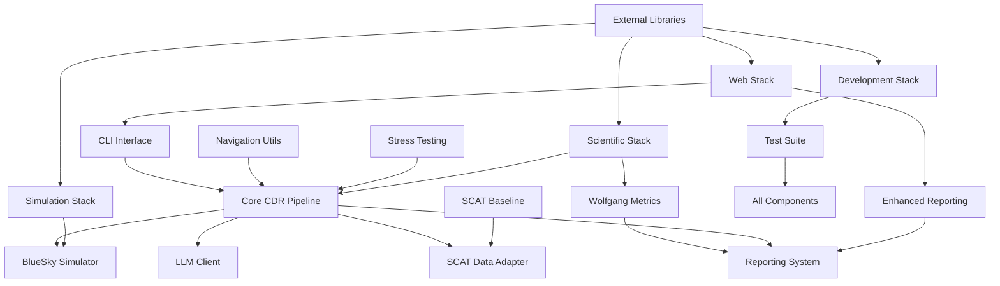

# ATC-LLM Comprehensive Dependency Matrix

This document provides a detailed analysis of all dependencies, modules, and their relationships within the ATC-LLM system.

## Overview

The ATC-LLM system is a complex aviation conflict detection and resolution system that integrates multiple components:
- **Core CDR Pipeline**: Main orchestration and conflict detection/resolution
- **LLM Integration**: AI-powered decision making via Ollama
- **BlueSky Simulation**: Aviation simulation environment
- **SCAT Data Processing**: Real aviation data integration
- **Research Metrics**: Wolfgang (2011) standardized aviation CDR metrics
- **Enhanced Reporting**: Comprehensive analytics and visualization

## Core System Dependencies

### Foundation Layer

| Component | File | Dependencies | Purpose |
|-----------|------|-------------|---------|
| **Data Models** | `schemas.py` | `pydantic`, `datetime`, `enum`, `typing` | Data validation, API contracts, enhanced reporting structures |
| **Aviation Math** | `geodesy.py` | `numpy`, `math` | Haversine calculations, bearing computations, aviation geometry |

### Integration Layer

| Component | File | Dependencies | Purpose |
|-----------|------|-------------|---------|
| **BlueSky Interface** | `bluesky_io.py` | `bluesky-simulator`, `telnetlib`, `threading`, `socket` | Aircraft simulation, state management |
| **LLM Client** | `llm_client.py` | `requests`, `json`, `typing`, `logging` | Ollama integration, conflict detection/resolution |
| **Navigation Utils** | `nav_utils.py` | `bluesky.navdatabase`, `geodesy`, `logging` | Waypoint resolution, named fix lookup |

### Algorithm Layer

| Component | File | Dependencies | Purpose |
|-----------|------|-------------|---------|
| **Conflict Detection** | `detect.py` | `numpy`, `geodesy`, `schemas`, `typing` | Geometric conflict prediction |
| **Resolution Execution** | `resolve.py` | `schemas`, `geodesy`, `nav_utils`, `logging` | Safety validation, command execution |
| **Wolfgang Metrics** | `wolfgang_metrics.py` | `pandas`, `numpy`, `scipy`, `math` | Research-standard aviation metrics |

### Orchestration Layer

| Component | File | Dependencies | Purpose |
|-----------|------|-------------|---------|
| **Main Pipeline** | `pipeline.py` | All core modules, `PromptBuilderV2` | CDR orchestration, adaptive timing |
| **Stress Testing** | `simple_stress_test.py` | `numpy`, `random`, `schemas`, `datetime` | System performance validation |

### Analysis Layer

| Component | File | Dependencies | Purpose |
|-----------|------|-------------|---------|
| **Basic Metrics** | `metrics.py` | `numpy`, `pandas`, `schemas`, `typing` | Performance tracking, KPIs |
| **Reporting System** | `reporting.py` | `pandas`, `matplotlib`, `json`, `pathlib` | Report generation, visualization |
| **SCAT Baseline** | `scat_baseline.py` | `scipy`, `numpy`, `geojson`, `KDTree` | Traffic analysis, neighbor identification |

### Data Processing Layer

| Component | File | Dependencies | Purpose |
|-----------|------|-------------|---------|
| **SCAT Adapter** | `scat_adapter.py` | `json`, `datetime`, `pathlib`, `typing` | Real aviation data processing |
| **ASAS Integration** | `asas_integration.py` | Core CDR modules | Airborne separation assurance |

## Script Dependencies

### CLI Interface

| Script | Dependencies | Purpose |
|--------|-------------|---------|
| `cli.py` | All `src.cdr` modules, `argparse`, `logging`, `sys`, `pathlib` | Unified command-line interface |

### Simulation Scripts

| Script | Core Dependencies | External Libraries | Purpose |
|--------|------------------|-------------------|---------|
| `complete_llm_demo.py` | Core CDR pipeline | `time`, `json`, `logging` | Basic demonstration |
| `complete_scat_llm_simulation.py` | Full CDR + SCAT | `math`, `dataclasses`, `datetime` | SCAT+LLM integration |
| `enhanced_scat_llm_simulation.py` | Core CDR + nav utils | `datetime`, `typing`, `logging` | Advanced navigation |
| `scat_llm_run.py` | SCAT + LLM + BlueSky | `time`, `pathlib`, `argparse` | Real-time runner |

### Analysis Scripts

| Script | Dependencies | Purpose |
|--------|-------------|---------|
| `scat_baseline.py` | SCAT adapter + geodesy, `csv`, `geojson` | Baseline generator |
| `verify_llm_communication.py` | LLM client, `traceback`, `os`, `time` | LLM testing |
| `visualize_conflicts.py` | Metrics + reporting, `matplotlib`, `seaborn` | Visualization |

### Batch Processing Scripts

| Script | Dependencies | Purpose |
|--------|-------------|---------|
| `batch_scat_llm_processor.py` | Full pipeline, `multiprocessing` | Batch processing |
| `production_batch_processor.py` | Core CDR + metrics, `concurrent.futures` | Production runs |
| `demo_baseline_vs_llm.py` | Pipeline + comparison, `statistics` | Comparison demo |

### Utility Scripts

| Script | Dependencies | Purpose |
|--------|-------------|---------|
| `organize_output_structure.py` | `pathlib`, `shutil`, `json` | Output organization |
| `repo_healthcheck.py` | System-wide validation, `subprocess` | Health diagnostics |

## Test Dependencies

### Unit Tests

| Test Module | System Under Test | Dependencies |
|-------------|------------------|-------------|
| `test_schemas.py` | Data models | `pytest`, `datetime` |
| `test_geodesy.py` | Aviation math | `pytest`, `numpy` |
| `test_detect.py` | Conflict detection | `pytest`, `mock` |
| `test_resolve.py` | Resolution execution | `pytest`, `mock` |
| `test_pipeline.py` | Main orchestrator | `pytest`, `mock`, `datetime` |

### Integration Tests

| Test Module | System Under Test | Dependencies |
|-------------|------------------|-------------|
| `test_bluesky_io.py` | BlueSky integration | `pytest`, `mock`, `threading` |
| `test_llm_client.py` | LLM integration | `pytest`, `requests-mock` |
| `test_scat_adapter.py` | SCAT data processing | `pytest`, `tempfile` |

### Enhanced Feature Tests

| Test Module | System Under Test | Dependencies |
|-------------|------------------|-------------|
| `test_enhanced_reporting.py` | Enhanced reporting | `unittest`, `tempfile`, `datetime` |
| `test_wolfgang_metrics.py` | Wolfgang metrics | `pytest`, `numpy`, `pandas` |
| `test_nav_utils.py` | Navigation utilities | `pytest`, `mock` |
| `test_prompt_builder_v2.py` | Advanced prompts | `pytest`, `datetime` |
| `test_asas_integration.py` | ASAS integration | `pytest`, `mock` |

### Comprehensive Tests

| Test Module | System Under Test | Dependencies |
|-------------|------------------|-------------|
| `test_*_comprehensive.py` | Full integration | `pytest`, `fixtures`, `mock` |
| `test_full_integration.py` | End-to-end testing | `pytest`, `tempfile`, `mock` |
| `verify_implementation.py` | Implementation validation | Core modules, `sys` |

## External Library Matrix

### Core Scientific Libraries

| Library | Version | Usage Areas | Critical Components |
|---------|---------|-------------|-------------------|
| `numpy` | ≥1.26.0 | Numerical computations | geodesy, detect, wolfgang_metrics, stress_test |
| `pandas` | 2.0.3 | Data analysis | wolfgang_metrics, reporting, analysis scripts |
| `scipy` | 1.11.1 | Spatial operations | scat_baseline (KDTree), advanced metrics |

### Data Validation & Models

| Library | Version | Usage Areas | Critical Components |
|---------|---------|-------------|-------------------|
| `pydantic` | 2.11.7 | Data validation | schemas, API validation, enhanced reporting |

### Aviation Simulation

| Library | Version | Usage Areas | Critical Components |
|---------|---------|-------------|-------------------|
| `bluesky-simulator` | latest | Flight simulation | bluesky_io, navigation database, aircraft dynamics |

### Machine Learning & AI

| Library | Version | Usage Areas | Critical Components |
|---------|---------|-------------|-------------------|
| `requests` | built-in | HTTP communication | llm_client, API calls to Ollama |
| `torch` | 2.0.1 | ML operations | LLM processing (optional) |
| `transformers` | 4.31.0 | Model handling | LLM integration (optional) |
| `huggingface-hub` | 0.16.4 | Model management | LLM model handling (optional) |

### Web Framework

| Library | Version | Usage Areas | Critical Components |
|---------|---------|-------------|-------------------|
| `fastapi` | 0.100.1 | REST API | api/service.py |
| `uvicorn` | 0.22.0 | ASGI server | API deployment |

### Testing Framework

| Library | Version | Usage Areas | Critical Components |
|---------|---------|-------------|-------------------|
| `pytest` | 7.4.0 | Test framework | All test modules |
| `pytest-cov` | 4.1.0 | Coverage analysis | Test reporting, CI/CD |

### Visualization & Reporting

| Library | Version | Usage Areas | Critical Components |
|---------|---------|-------------|-------------------|
| `matplotlib` | 3.7.2 | Plotting | reporting, visualization scripts |
| `seaborn` | 0.12.2 | Statistical plots | Advanced visualizations |
| `rich` | 13.4.2 | Console output | CLI formatting, progress bars |

### Development Tools

| Library | Version | Usage Areas | Critical Components |
|---------|---------|-------------|-------------------|
| `black` | 23.7.0 | Code formatting | Development workflow |
| `ruff` | 0.0.280 | Linting | Code quality, static analysis |
| `mypy` | 1.4.1 | Type checking | Static type analysis |

### Utilities

| Library | Version | Usage Areas | Critical Components |
|---------|---------|-------------|-------------------|
| `structlog` | 23.1.0 | Structured logging | Enhanced logging across system |
| `python-dotenv` | 1.0.0 | Configuration | Environment variable management |
| `ipython` | 8.14.0 | Development | Interactive development |
| `jupyter` | 1.0.0 | Notebooks | Data analysis, experimentation |

## Dependency Flow Analysis

### Critical Path Dependencies

### Module Coupling Analysis

| Module | Coupling Level | Dependencies | Dependents |
|--------|---------------|-------------|------------|
| `schemas.py` | Low | `pydantic`, `datetime` | Almost all modules |
| `geodesy.py` | Low | `numpy`, `math` | `detect`, `resolve`, `nav_utils` |
| `pipeline.py` | High | All core modules | CLI, scripts, tests |
| `llm_client.py` | Medium | `requests`, `schemas` | `pipeline`, `scripts` |
| `bluesky_io.py` | Medium | `bluesky-simulator` | `pipeline`, `scripts` |
| `wolfgang_metrics.py` | Low | `pandas`, `numpy`, `scipy` | Reporting, analysis |
| `nav_utils.py` | Low | `bluesky.navdatabase` | `resolve`, navigation scripts |

### Dependency Risk Assessment

| Risk Level | Components | Impact | Mitigation |
|------------|------------|--------|------------|
| **High** | `bluesky-simulator` | Core simulation capability | Version pinning, fallback modes |
| **High** | `numpy`, `pandas` | Scientific computations | Well-established libraries |
| **Medium** | `pydantic` | Data validation | Stable API, good documentation |
| **Medium** | Ollama/LLM backend | AI functionality | Error handling, fallback modes |
| **Low** | Development tools | Code quality | Non-critical for runtime |

### Performance Impact Analysis

| Component | Performance Impact | Optimization Strategy |
|-----------|-------------------|---------------------|
| `wolfgang_metrics.py` | High (pandas operations) | Vectorized operations, chunking |
| `scat_baseline.py` | High (spatial operations) | KDTree for efficient spatial queries |
| `bluesky_io.py` | Medium (network I/O) | Connection pooling, async operations |
| `llm_client.py` | Medium (HTTP requests) | Request caching, timeout handling |
| `detect.py` | Low (optimized algorithms) | NumPy vectorization |

## Module Interdependency Summary

### Strong Dependencies (High Coupling)
- **Core Pipeline** ↔ All major components (bluesky_io, llm_client, detect, resolve)
- **Schemas** → Nearly all modules (data contracts)
- **Geodesy** → Aviation-specific modules (detect, resolve, nav_utils)

### Weak Dependencies (Loose Coupling)
- **Wolfgang Metrics** → Independent analysis module
- **Navigation Utils** → Optional enhancement for waypoint resolution
- **SCAT Baseline** → Standalone analysis tool
- **Stress Testing** → Independent validation module

### Interface Dependencies
- **CLI** → All modules through well-defined interfaces
- **Tests** → All modules through public APIs
- **Scripts** → Core modules through documented entry points

### Configuration Dependencies
- **Environment Variables** → LLM settings, BlueSky configuration
- **Configuration Files** → Advanced pipeline settings, metrics parameters
- **Command Line Arguments** → Runtime behavior modification

## Maintenance Guidelines

### Adding New Dependencies
1. **Evaluate necessity**: Is the dependency essential?
2. **Check compatibility**: Does it work with existing versions?
3. **Update requirements.txt**: Pin specific versions
4. **Add to this matrix**: Document purpose and impact
5. **Update tests**: Ensure compatibility testing

### Removing Dependencies
1. **Check dependents**: What modules use this dependency?
2. **Provide alternatives**: How will functionality be maintained?
3. **Update documentation**: Reflect changes in this matrix
4. **Test thoroughly**: Ensure no regression

### Version Updates
1. **Test compatibility**: Run full test suite
2. **Check breaking changes**: Review release notes
3. **Update documentation**: Reflect any API changes
4. **Gradual rollout**: Update non-critical dependencies first

---

**Last Updated**: August 10, 2025  
**System Version**: 1.0.0  
**Total Components**: 50+ modules and scripts  
**External Dependencies**: 25+ libraries
