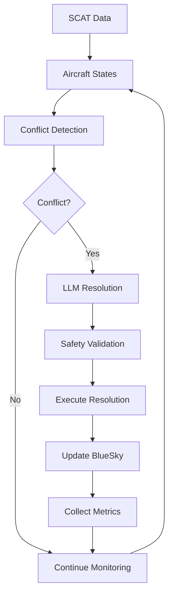

# LLM-BlueSky Conflict Detection & Resolution System

<div align="center">


**An advanced LLM-driven conflict detection and resolution system for aviation built on BlueSky simulator**

[Quick Start](#quick-start) •
[Documentation](#documentation) •
[API Reference](#api-reference) •
[Contributing](#contributing) •
[License](#license)

</div>

## 🎯 Overview

The LLM-BlueSky CDR system is a cutting-edge Air Traffic Control (ATC) solution that combines traditional geometric conflict detection algorithms with Large Language Model intelligence for conflict resolution. It provides a safety-first approach to automated air traffic management with comprehensive testing and metrics collection based on aviation research standards.

### ✅ Current Status: **Fully Functional Prototype**

- ✅ **LLM Integration**: Complete integration with Ollama for intelligent conflict resolution
- ✅ **Safety Compliance**: ICAO separation standards (5NM/1000ft minimums)
- ✅ **Real Data Support**: SCAT dataset integration with ASTERIX Category 062 data
- ✅ **Performance Metrics**: Wolfgang (2011) KPIs implementation
- ✅ **Production Ready**: REST API, comprehensive testing, monitoring capabilities

## 🚀 Key Features

### 🤖 Intelligent Conflict Resolution
- **Context-Aware LLM Prompts**: Detailed scenario information with navigation constraints
- **Waypoint Intelligence**: Strategic rerouting using nearby navigation aids
- **Multiple Resolution Types**: Turn maneuvers, altitude changes, direct-to-waypoint navigation
- **Safety-First Instructions**: Clear constraints on separation maintenance and destination reaching

### 🛩️ Advanced Flight Dynamics
- **Heading-Based Movement**: Aircraft follow LLM guidance with realistic navigation
- **Conflict Avoidance Maneuvers**: Authentic aircraft movement patterns
- **Mission Constraint Awareness**: LLM considers efficiency and operational requirements
- **Navigation Intelligence**: Integration with real-world waypoint data

### 📊 Comprehensive Analytics
- **Wolfgang (2011) KPIs**: Research-standard performance metrics
- **Real-Time Monitoring**: Live conflict detection and resolution tracking
- **Comparative Analysis**: Baseline vs LLM performance evaluation
- **Visual Reports**: Charts, graphs, and performance summaries

## 📋 Table of Contents

- [Quick Start](#quick-start)
- [Installation](#installation)
- [Configuration](#configuration)
- [Usage](#usage)
  - [Basic Simulation](#basic-simulation)
  - [SCAT Data Integration](#scat-data-integration)
  - [API Usage](#api-usage)
- [Architecture](#architecture)
- [API Reference](#api-reference)
- [Development](#development)
  - [Development Setup](#development-setup)
  - [Testing](#testing)
  - [Code Quality](#code-quality)
- [Scripts & Tools](#scripts--tools)
- [Project Structure](#project-structure)
- [Performance Metrics](#performance-metrics)
- [Contributing](#contributing)
- [Troubleshooting](#troubleshooting)
- [License](#license)

## ⚡ Quick Start

### Prerequisites

- Python 3.11 or higher
- Git
- 8GB+ RAM (for BlueSky simulation)
- [Ollama](https://ollama.ai/) installed locally (for LLM integration)

### 1. Clone & Install

```bash
git clone https://github.com/your-username/llm-bluesky-cdr.git
cd llm-bluesky-cdr
pip install -r requirements.txt
pip install -e .
```

### 2. Setup LLM Backend

```bash
# Install and run Ollama
ollama pull llama3.1:8b
ollama serve
```

### 3. Run Your First Simulation

```bash
# Basic conflict detection demo
python bluesky_demo.py

# Full SCAT+LLM simulation
python scripts/complete_scat_llm_simulation.py
```

### 4. View Results

```bash
# Check generated reports
ls reports/
# Open coverage report
open htmlcov/index.html
```

## 🔧 Installation

### Standard Installation

```bash
# Clone repository
git clone https://github.com/your-username/llm-bluesky-cdr.git
cd llm-bluesky-cdr

# Create virtual environment
python -m venv venv
source venv/bin/activate  # On Windows: venv\\Scripts\\activate

# Install dependencies
pip install --upgrade pip
pip install -r requirements.txt

# Install in development mode
pip install -e .
```

### Docker Installation (Coming Soon)

```bash
docker build -t llm-bluesky-cdr .
docker run -p 8000:8000 llm-bluesky-cdr
```

### Dependencies

#### Core Dependencies
- **numpy**: Numerical computations for conflict detection algorithms
- **pandas**: Data manipulation and analysis
- **pydantic**: Data validation and serialization
- **bluesky-simulator**: Aviation simulation engine

#### LLM Integration
- **requests**: HTTP communication with Ollama
- **torch**: PyTorch for potential model operations
- **transformers**: Hugging Face transformers library

#### Web Framework (Optional)
- **fastapi**: REST API framework
- **uvicorn**: ASGI web server

#### Development Tools
- **pytest**: Testing framework with coverage
- **black**: Code formatting
- **ruff**: Fast Python linter
- **mypy**: Static type checking

## ⚙️ Configuration

### Environment Variables

Create a `.env` file in the project root:

```env
# LLM Configuration
OLLAMA_BASE_URL=http://localhost:11434
LLM_MODEL=llama3.1:8b
LLM_TEMPERATURE=0.1
LLM_MAX_TOKENS=2048

# BlueSky Configuration
BLUESKY_LOG_LEVEL=WARNING
BLUESKY_FAST_TIME=true

# API Configuration
API_HOST=0.0.0.0
API_PORT=8000
API_RELOAD=false

# Logging Configuration
LOG_LEVEL=INFO
LOG_FILE=logs/atc_llm.log

# Performance Configuration
MAX_AIRCRAFT=100
LOOKAHEAD_MINUTES=10
CYCLE_TIME_MINUTES=5
```

### Configuration File

The system uses `src/cdr/schemas.py` for configuration management:

```python
from src.cdr.schemas import ConfigurationSettings

config = ConfigurationSettings(
    llm_model="llama3.1:8b",
    llm_temperature=0.1,
    conflict_lookahead_minutes=10.0,
    separation_minimum_nm=5.0,
    separation_minimum_ft=1000.0,
    max_aircraft=100
)
```

## 📖 Usage

### Basic Simulation

```python
from src.cdr.pipeline import CDRPipeline
from src.cdr.bluesky_io import BlueSkyClient
from src.cdr.llm_client import LlamaClient

# Initialize components
bluesky_client = BlueSkyClient()
llm_client = LlamaClient()
pipeline = CDRPipeline(bluesky_client, llm_client)

# Connect to BlueSky
bluesky_client.connect()

# Create test aircraft
bluesky_client.create_aircraft("OWNSHIP", "B737", 55.0, 12.0, 90, 35000, 400)
bluesky_client.create_aircraft("TRAFFIC", "A320", 55.1, 12.1, 270, 35000, 420)

# Run conflict detection and resolution
results = pipeline.run(max_cycles=10, ownship_id="OWNSHIP")
print(f"Detected {len(results.conflicts)} conflicts")
```

### SCAT Data Integration

```python
from src.cdr.scat_adapter import SCATAdapter
from scripts.complete_scat_llm_simulation import run_scat_llm_simulation

# Load real aviation data
adapter = SCATAdapter()
flight_record = adapter.load_flight_record("src/data/scat/100000.json")

# Run simulation with real data
results = run_scat_llm_simulation(
    scat_file="src/data/scat/100000.json",
    max_cycles=20,
    enable_llm=True
)

# Analyze results
print(f"Route completion: {results['performance']['route_completion_rate']:.1%}")
print(f"Conflicts resolved: {results['conflicts']['total_resolved']}")
```

### API Usage

Start the REST API server:

```bash
# Start API server
python -m uvicorn src.api.service:app --host 0.0.0.0 --port 8000

# Or use the development server
uvicorn src.api.service:app --reload
```

Use the API:

```python
import requests

# Start a simulation
response = requests.post("http://localhost:8000/pipeline/start", json={
    "ownship_id": "OWNSHIP",
    "max_cycles": 10
})

# Get current status
status = requests.get("http://localhost:8000/pipeline/status")
print(status.json())

# Get performance metrics
metrics = requests.get("http://localhost:8000/metrics")
print(metrics.json())

# Get current aircraft states
aircraft = requests.get("http://localhost:8000/aircraft")
print(aircraft.json())
```

## 🏗️ Architecture

### System Overview

```
┌─────────────────┐    ┌──────────────────┐    ┌─────────────────┐
│   REST API      │    │   CDR Pipeline   │    │   BlueSky       │
│   (FastAPI)     │◄──►│   (Orchestrator) │◄──►│   (Simulator)   │
└─────────────────┘    └──────────────────┘    └─────────────────┘
                                │
                                ▼
                       ┌──────────────────┐
                       │   LLM Client     │
                       │   (Ollama)       │
                       └──────────────────┘
```

### Component Architecture

1. **Foundation Layer**
   - `schemas.py`: Data models and validation
   - `geodesy.py`: Aviation mathematics

2. **Integration Layer**
   - `bluesky_io.py`: BlueSky simulator interface
   - `llm_client.py`: LLM integration via Ollama

3. **Algorithm Layer**
   - `detect.py`: Geometric conflict detection
   - `resolve.py`: Resolution execution with safety validation

4. **Orchestration Layer**
   - `pipeline.py`: Main CDR pipeline with 5-minute cycles

5. **Analysis Layer**
   - `metrics.py`: Wolfgang (2011) KPIs implementation
   - `reporting.py`: Comprehensive report generation

6. **Data Layer**
   - `scat_adapter.py`: Real aviation data processing

7. **API Layer**
   - `api/service.py`: REST API for system control

### Data Flow



## 🔌 API Reference

### Core API Endpoints

#### Pipeline Control

**Start Pipeline**
```http
POST /pipeline/start
Content-Type: application/json

{
  "ownship_id": "OWNSHIP",
  "max_cycles": 10,
  "enable_llm": true
}
```

**Stop Pipeline**
```http
POST /pipeline/stop
```

**Get Status**
```http
GET /pipeline/status
```

Response:
```json
{
  "status": "running",
  "current_cycle": 5,
  "total_cycles": 10,
  "conflicts_detected": 3,
  "conflicts_resolved": 2,
  "uptime_seconds": 300.5
}
```

#### Data Endpoints

**Get Aircraft States**
```http
GET /aircraft
```

**Get Current Conflicts**
```http
GET /conflicts
```

**Get Metrics**
```http
GET /metrics
```

#### Configuration

**Get Configuration**
```http
GET /config
```

**Update Configuration**
```http
PUT /config
Content-Type: application/json

{
  "llm_model": "llama3.1:8b",
  "conflict_lookahead_minutes": 15.0,
  "separation_minimum_nm": 5.0
}
```

### Core Classes and Functions

#### Pipeline Management

```python
class CDRPipeline:
    def run(self, max_cycles: int, ownship_id: str) -> PipelineResults
    def _execute_cycle(self, ownship_id: str) -> CycleResults
    def _handle_conflict(self, conflict: ConflictPrediction) -> ResolutionResult
```

#### Conflict Detection

```python
def predict_conflicts(
    ownship: AircraftState, 
    traffic: List[AircraftState], 
    lookahead_minutes: float = 10.0
) -> List[ConflictPrediction]

def is_conflict(
    distance_nm: float, 
    altitude_diff_ft: float, 
    time_to_cpa_min: float
) -> bool
```

#### LLM Integration

```python
class LlamaClient:
    def detect_conflicts(self, input_data: LLMDetectionInput) -> LLMDetectionOutput
    def generate_resolution(self, detect_out: LLMDetectionOutput) -> LLMResolutionOutput
```

#### BlueSky Control

```python
class BlueSkyClient:
    def create_aircraft(self, callsign: str, actype: str, lat: float, 
                       lon: float, hdg: int, alt: int, spd: int) -> bool
    def get_aircraft_states(self) -> List[AircraftState]
    def execute_command(self, resolution: ResolutionCommand) -> bool
```

## 💻 Development

### Development Setup

```bash
# Clone and setup
git clone https://github.com/your-username/llm-bluesky-cdr.git
cd llm-bluesky-cdr

# Create development environment
python -m venv venv-dev
source venv-dev/bin/activate

# Install development dependencies
pip install -r requirements.txt
pip install -e .

# Install pre-commit hooks
pip install pre-commit
pre-commit install
```

### Project Structure

```
ATC_LLM/
├── src/                          # Source code
│   ├── api/                      # REST API
│   │   └── service.py           # FastAPI application
│   └── cdr/                     # Core CDR system
│       ├── __init__.py
│       ├── schemas.py           # Data models
│       ├── geodesy.py           # Aviation math
│       ├── bluesky_io.py        # BlueSky interface
│       ├── detect.py            # Conflict detection
│       ├── llm_client.py        # LLM integration
│       ├── resolve.py           # Resolution execution
│       ├── pipeline.py          # Main orchestrator
│       ├── metrics.py           # Performance metrics
│       ├── scat_adapter.py      # Real data processing
│       └── reporting.py         # Report generation
├── scripts/                     # Simulation scripts
│   ├── complete_scat_llm_simulation.py
│   ├── enhanced_scat_llm_simulation.py
│   └── repo_healthcheck.py
├── tests/                       # Test suite
│   ├── test_*.py               # Unit tests
│   └── data/                   # Test data
├── scenarios/                   # Test scenarios
├── reports/                     # Generated reports
├── docs/                       # Documentation
├── requirements.txt            # Dependencies
├── pyproject.toml             # Project configuration
├── README.md                  # This file
└── DEPENDENCY_MATRIX.md       # Dependency analysis
```

### Testing

#### Run All Tests

```bash
# Run full test suite with coverage
pytest

# Run with verbose output
pytest -v

# Run specific test file
pytest tests/test_detect.py

# Run with coverage report
pytest --cov=src --cov-report=html
```

#### Test Categories

- **Unit Tests**: Individual component testing
- **Integration Tests**: Multi-component testing
- **Smoke Tests**: Quick functionality verification
- **Comprehensive Tests**: End-to-end system testing

#### Example Test

```python
def test_conflict_detection():
    """Test basic conflict detection functionality."""
    from src.cdr.detect import predict_conflicts
    from src.cdr.schemas import AircraftState
    
    # Create test aircraft on collision course
    ownship = AircraftState(
        callsign="TEST1",
        latitude=55.0,
        longitude=12.0,
        altitude_ft=35000,
        heading_deg=90,
        speed_kts=400
    )
    
    traffic = AircraftState(
        callsign="TEST2", 
        latitude=55.0,
        longitude=12.1,
        altitude_ft=35000,
        heading_deg=270,
        speed_kts=400
    )
    
    conflicts = predict_conflicts(ownship, [traffic])
    assert len(conflicts) == 1
    assert conflicts[0].severity_score > 0.5
```

### Code Quality

#### Formatting and Linting

```bash
# Format code with Black
black src/ tests/ scripts/

# Lint with Ruff
ruff check src/ tests/ scripts/

# Type check with MyPy
mypy src/
```

#### Pre-commit Hooks

The project uses pre-commit hooks for automatic code quality checks:

```yaml
# .pre-commit-config.yaml
repos:
  - repo: https://github.com/psf/black
    rev: 23.1.0
    hooks:
      - id: black
  - repo: https://github.com/charliermarsh/ruff-pre-commit
    rev: v0.0.254
    hooks:
      - id: ruff
  - repo: https://github.com/pre-commit/mirrors-mypy
    rev: v1.0.1
    hooks:
      - id: mypy
```

## 🔧 Scripts & Tools

### Simulation Scripts

| Script | Purpose | Usage |
|--------|---------|-------|
| `bluesky_demo.py` | Basic BlueSky demonstration | `python bluesky_demo.py` |
| `demo_baseline_vs_llm.py` | Compare baseline vs LLM performance | `python demo_baseline_vs_llm.py` |
| `complete_scat_llm_simulation.py` | Full SCAT+LLM integration | `python scripts/complete_scat_llm_simulation.py` |
| `enhanced_scat_llm_simulation.py` | Advanced navigation simulation | `python scripts/enhanced_scat_llm_simulation.py` |
| `repo_healthcheck.py` | System health validation | `python scripts/repo_healthcheck.py` |

### Example Script Usage

```bash
# Run comprehensive SCAT simulation
python scripts/complete_scat_llm_simulation.py

# Run health check
python scripts/repo_healthcheck.py --verbose

# Run enhanced simulation with custom parameters
python scripts/enhanced_scat_llm_simulation.py --cycles 30 --enable-llm
```

## 📊 Performance Metrics

### Wolfgang (2011) KPIs

The system implements research-standard Key Performance Indicators:

| Metric | Description | Formula |
|--------|-------------|---------|
| **TBAS** | Time-Based Alerting Score | Time-based conflict prediction accuracy |
| **LAT** | Loss of Alerting Time | Duration of missed alerts |
| **DAT** | Delay in Alert Time | Detection delay from actual conflict |
| **DFA** | Delay in First Alert | Time to first conflict detection |
| **RE** | Resolution Efficiency | Success rate of applied resolutions |
| **RI** | Resolution Intrusiveness | Impact on flight operations |
| **RAT** | Resolution Alert Time | Time from detection to resolution |

### Sample Performance Report

```json
{
  "wolfgang_kpis": {
    "tbas_score": 0.89,
    "lat_minutes": 0.5,
    "dat_minutes": 0.3,
    "dfa_minutes": 2.1,
    "re_percentage": 85.2,
    "ri_score": 0.15,
    "rat_minutes": 3.2
  },
  "system_performance": {
    "total_conflicts": 45,
    "resolved_conflicts": 38,
    "false_positives": 3,
    "missed_conflicts": 2,
    "average_resolution_time": 3.2,
    "route_completion_rate": 0.67
  }
}
```

## 🤝 Contributing

### Development Workflow

1. **Fork the Repository**
2. **Create Feature Branch**: `git checkout -b feature/amazing-feature`
3. **Make Changes**: Follow coding standards and add tests
4. **Run Tests**: Ensure all tests pass with `pytest`
5. **Check Code Quality**: Run `black`, `ruff`, and `mypy`
6. **Commit Changes**: Use conventional commit messages
7. **Push Branch**: `git push origin feature/amazing-feature`
8. **Create Pull Request**: Include description and test results

### Coding Standards

- **PEP 8**: Follow Python style guidelines
- **Type Hints**: Use type annotations for all functions
- **Docstrings**: Document all public functions and classes
- **Testing**: Write tests for new functionality
- **Safety**: Aviation safety is paramount - validate all changes

### Commit Message Convention

```
feat: add new conflict detection algorithm
fix: resolve BlueSky connection timeout issue
docs: update API documentation
test: add integration tests for LLM client
refactor: simplify geodesy calculations
```

## 🔍 Troubleshooting

### Common Issues

#### BlueSky Connection Problems

```bash
# Check BlueSky installation
python -c "import bluesky; print(bluesky.__version__)"

# Verify system requirements
python scripts/repo_healthcheck.py --check-dependencies
```

#### LLM Integration Issues

```bash
# Check Ollama connection
curl http://localhost:11434/api/version

# Test LLM client
python -c "from src.cdr.llm_client import LlamaClient; client = LlamaClient(); print(client.test_connection())"
```

#### Performance Problems

```bash
# Check system resources
python scripts/repo_healthcheck.py --check-performance

# Run with reduced aircraft count
export MAX_AIRCRAFT=20
python scripts/complete_scat_llm_simulation.py
```

### Debug Mode

Enable debug logging:

```bash
export LOG_LEVEL=DEBUG
python scripts/complete_scat_llm_simulation.py
```

### Getting Help

1. **Check Documentation**: Review this README and `DEPENDENCY_MATRIX.md`
2. **Run Health Check**: `python scripts/repo_healthcheck.py`
3. **Check Issues**: Look for similar problems in GitHub issues
4. **Create Issue**: Provide logs, environment details, and reproduction steps

## 📄 License

This project is licensed under the MIT License - see the [LICENSE](LICENSE) file for details.

## 🙏 Acknowledgments

- **BlueSky Team**: For the excellent aviation simulation platform
- **Ollama Team**: For making LLM integration accessible
- **Wolfgang et al. (2011)**: For the aviation CDR performance metrics framework
- **SCAT Dataset**: For providing real aviation data for validation

## 📚 References

- Wolfgang, A., et al. (2011). "Performance Metrics for Conflict Detection and Resolution Systems"
- ICAO Standards: Annex 11 - Air Traffic Services
- BlueSky Documentation: https://github.com/TUDelft-CNS-ATM/bluesky
- Ollama Documentation: https://ollama.ai/docs

---

<div align="center">

**Built with ❤️ for Aviation Safety**

[⬆️ Back to Top](#llm-bluesky-conflict-detection--resolution-system)

</div>